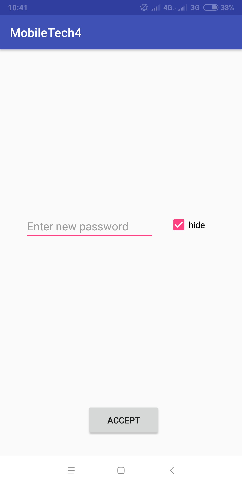
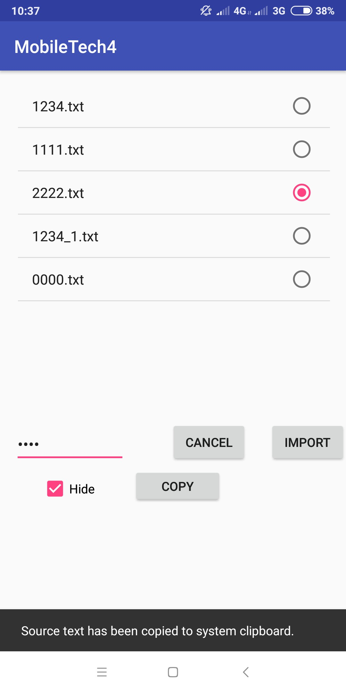
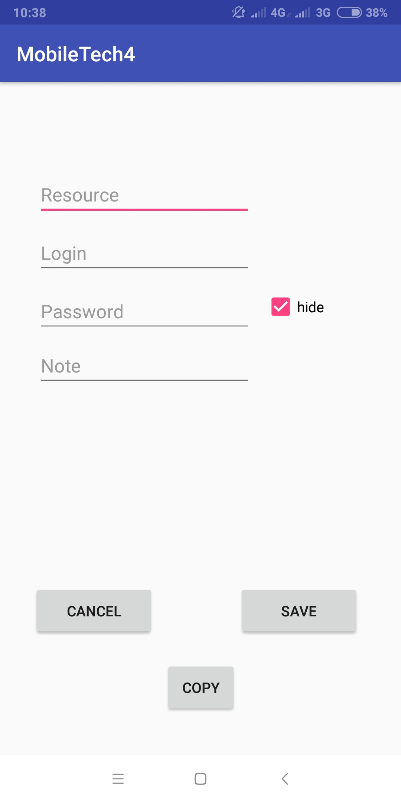
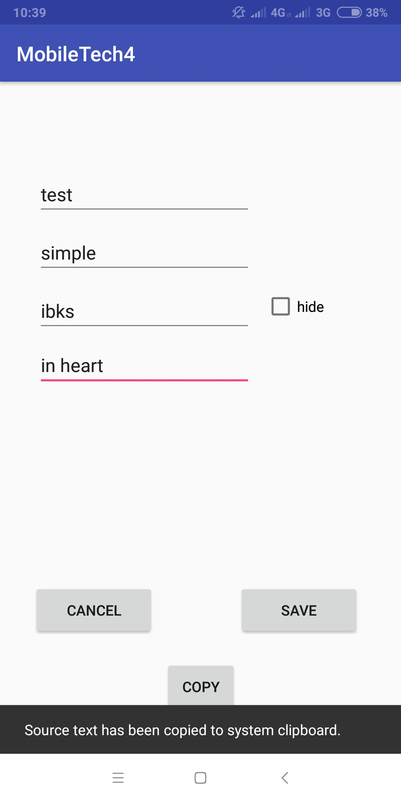
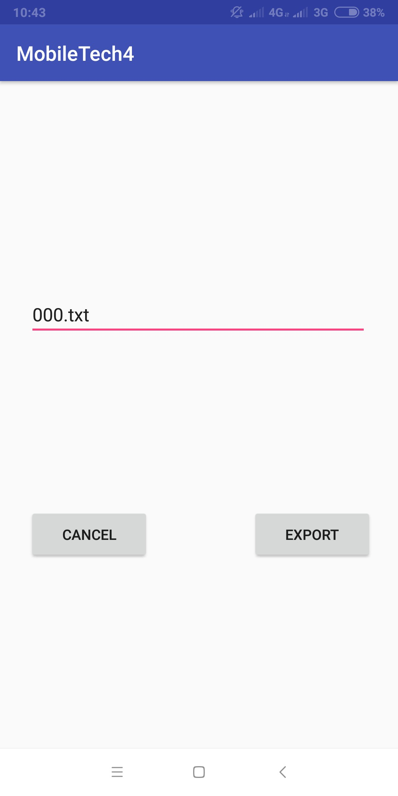
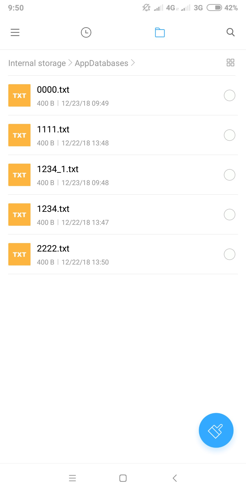
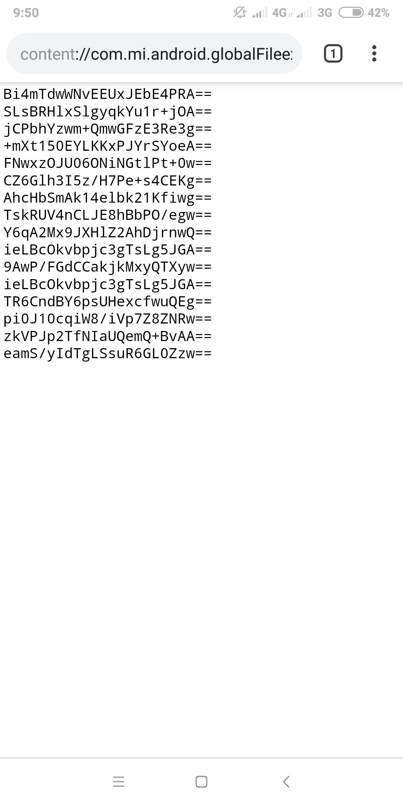
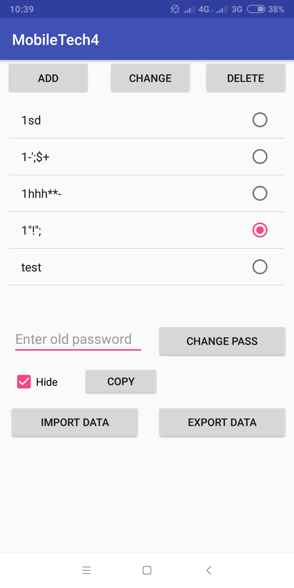

# MobileTech
Simple password manager, use SQLite and Cipher
Can export/import the database to/from a file

For Android Studio:
- export project: File->Export to Zip File...
- import project: File->New->Import Project...

When adding a record to the database, each of its fields is encrypted using the AES algorithm and EBC encryption mode. After encryption, all data is Base64 encoded to remove unwanted characters from them for easy storage in files and strings.

For Encrypt/Decrypt use initialization vector (iv), add (see e.g._CryptoProvider.java):
```
final byte[] iv = { 1, 2, 3, 4, 5, 6, 7, 8};
IvParameterSpec ivParameterSpec = new IvParameterSpec(iv);
SecretKeySpec key = new SecretKeySpec(keyBytes, "Blowfish");
Cipher cipher = Cipher.getInstance("Blowfish/CFB/PKCS5Padding");
cipher.init(Cipher.ENCRYPT_MODE, key, ivParameterSpec);
```







The application also allows you to export the database to a file on an SD card (getExternalStorageState ()). The application creates the AppDatabases directory




